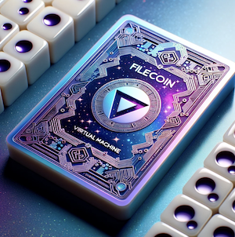
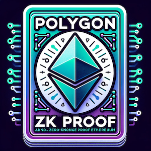
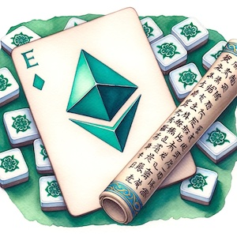
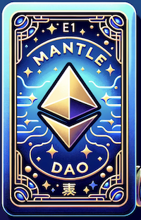

🚀 Welcome aboard, Spaceman! 🚀

As a crypto enthusiast navigating the vast universe of DeFi, you need a reliable spaceship equipped with the most advanced tools. Our project is designed to be your trusted companion in this journey, enhancing your DeFi experience by making it smoother, safer, and more profitable. Here's a detailed overview of our project, categorized by each of our esteemed sponsors:

[NextId](#nextid) | [XMTP](#xmtp) | [Push Protocol](#push-protocol) | [Gnosis Safe](#gnosis-safe) | [Uniswap](#uniswap) | [Spark Lend](#spark-lend) | [ApeCoin](#apecoin) | [zkEVM](#zkevm) | [Scroll Testnet](#scroll-testnet) | [Mantle](#mantle) | [Filecoin Virtual Machine](#filecoin-virtual-machine) | [The Graph](#the-graph) | [Connext](#connext)

## NextId
Our user interface, designed like a spaceship command center, provides an immersive and interactive experience. It leverages the NextId RelationService API for fetching user's information and facilitates real-time communication within the interface. This integration has made it easier to search for users, enhancing the overall user experience.

## XMTP
We've taken XMTP chat to the next level by creating a fork that works seamlessly with the Mask network. This feature allows users to search any connected social accounts and resolve them to an address which can be messaged. We've also integrated Privy, enabling users to conveniently login with their Apple and Google accounts and export their wallet directly from the website!

## Filecoin Virtual Machine
We've innovatively incorporated on-chain achievements into our `Mintable.sol` contract. This enables the creation of unique achievements related to balance, farming, and borrowing. It's all self-service, eliminating the need for trust-based airdrops. Plus, it's fully interoperable, allowing anyone who connects to NFTs to participate. This game-changing feature makes the DeFi space more engaging and rewarding for users. We've also integrated achievements for Filecoin Virtual Machine holders. Prove you own some Filecoin to earn the NFT!

## Gnosis Safe
We've developed a module for Connext that enables safes to send messages across chains. This cross-chain communication enhances the functionality of Gnosis Safe by allowing for more complex and versatile transactions.

## Connext
We've integrated Connext, a modular interoperability protocol that lets you build secure crosschain dApps (xApps). We've created a Gnosis Safe connector module that lets safes communicate between chains using Connext as a bridge.

## The Graph
We've deployed a subgraph for the NFT achievements. You can explore it [here](https://thegraph.com/studio/subgraph/achievements/).

## Push Protocol
We've integrated the Push Protocol to add push chat and calling features. Now, you can initiate a chat or a call with just a click of a button.

## Gnosis Safe
We've enhanced our governance module by integrating the Connext bridge for cross-chain communications within the Gnosis Safe. This pivotal upgrade allows safes to send messages to each other across different chains and execute cross-chain transactions, thereby significantly improving the efficiency and versatility of governance protocols.

## Compound
In our quest to make DeFi more engaging and rewarding, we've innovatively incorporated on-chain achievements into our `Mintable.sol` contract specifically for Compound. This feature enables users to earn unique NFTs based on their positions on Compound, adding an exciting layer of gamification to the DeFi experience. 

In addition to the features mentioned, we've introduced performance tokens. These tokens are designed to take a performance fee off the interest-bearing tokens across various protocols. This unique feature is not confined to our platform but extends to other DeFi protocols as well, enhancing interoperability and enriching the user experience in the DeFi space.

## Uniswap
Our liquidation engine works with Stability MAI (sMAI for short). It uses user-staked MAI to liquidate loans and uses UniswapV4 hooks to sell the collateral at a certain MAI price. This integration into the stability pool of MAI allows the stability pool contract to sell into Uniswap when the price is acceptable.

## Polygon zkEVM
We've deployed an NFT achievements contract to let users earn NFTs for their on-chain activity. We've created a demo and art for ETH holders on zkEVM.

## Spark Lend
Our versatile contract uses interest-bearing assets as collateral in lending protocols. It's compatible with SparkLend, the erc4626 sDAI, and also works with Compound lending. Protocols integrating with us get a cut of the earnings, making it a win-win situation for all.

## ApeCoin
We've innovatively incorporated on-chain achievements into our `Mintable.sol` contract. This enables the creation of unique achievements related to balance, farming, and borrowing. It's all self-service, eliminating the need for trust-based airdrops. Plus, it's fully interoperable, allowing anyone who connects to NFTs to participate. This game-changing feature makes the DeFi space more engaging and rewarding for users. We've also integrated achievements for ApeCoin holders. Prove you own some ApeCoin to earn the NFT!

## Scroll Testnet
We've deployed an NFT achievements contract to let users earn NFTs for their on-chain activity. We've created a demo and art for ETH holders on Scroll Testnet. You can view the contract https://sepolia.scrollscan.dev/address/0xDD8EAB7d0b12df6faFAd27e14FEa446e40b4d98E#contracts.

## Mantle
We've deployed an NFT achievements contract to let users earn NFTs for their on-chain activity. We've created a demo and art for MNT holders on Mantle.
https://explorer.mantle.xyz/address/0xFf0756582c66D59F3C1bd413F7D0A720c99B9992

Our codebase also includes contracts and interfaces for vaults and liquidators, among other features. We hope this detailed overview helps you understand our project better!

